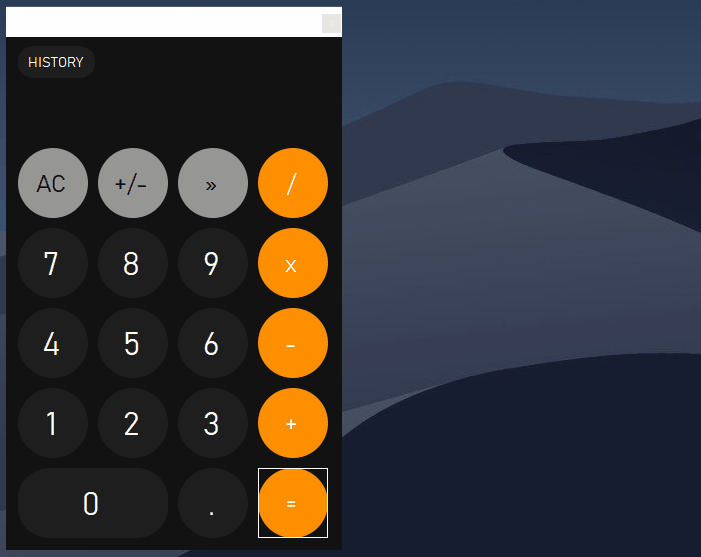

WinForm calculator inspired by apple design
===

what it is
---

it's my old student funny project (i'm still student in 2020), i placed it here just as a keepsake :)




Controls
---
* H to show/hide history
* C to clear history

P.S.
===

```c++
#define ever (;;)

word main(){

	for ever{
		feel_free_to_correct_me_in (english, code, anything);
	}

	return thank_you;
}
```